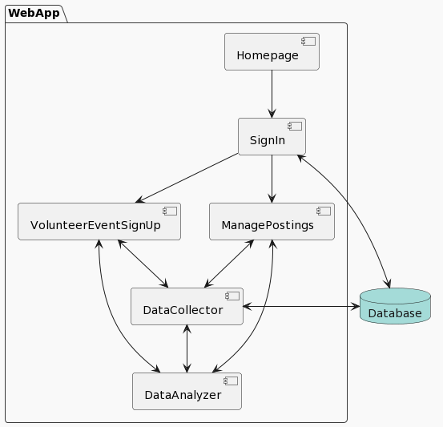

# Overview

## Introduction
The Volunteer Management System (VMS) is a comprehensive web application designed to facilitate the organization and participation in volunteer events. It serves as a platform for hosts to manage events and for volunteers to sign up for available opportunities.

## Objectives
- To provide a centralized system for managing volunteer events.
- To streamline the process of event creation, editing, and deletion for hosts.
- To offer a platform for the sign-up process for volunteers, ensuring no overbooking.
- To maintain an organized schedule that prevents shift overlaps and hiding irrelevant/expired events.

## Features
- Homepage: A welcoming page with login options for hosts and volunteers.
- Shared Login Page: A single login page that authenticates users and directs them to the appropriate interface based on the option selected on the homepage.
- Host Interface: Allows hosts to manage event postings and volunteer requirements which includes the ability to create, edit, and delete events.
- Volunteer Interface: Enables volunteers to browse and sign-up for events.
- Data Collector: Gathers and stores volunteer sign ups and the events postings in the database.
- Data Analyzer: Ensures no shift overlaps and filters out expired events.
- Database: SQL for all application data.

## Architecture
The application’s architecture is designed for ease of use. The UML diagram below provides a visual representation of the user flow and system components.
